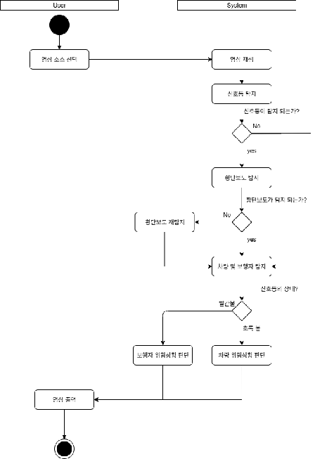
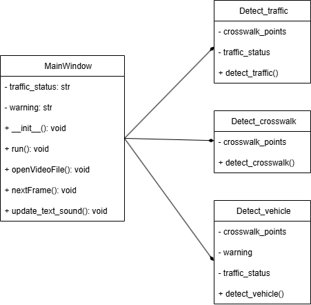

# **프로젝트 기술서**

1조      조영재, 강덕호, 김종훈

# 

# **1\. 개요**

## **1.1 프로젝트 주제**

주제 : 횡단보도 보행자 인식 프로그램

본 프로젝트는 횡단보도에서 보행자의 움직임을 감지하고, 다양한 위험 상황을 판단하여 보행자에게 경고를 제공하는 지능형 보행자 인식 시스템을 개발하는 것을 목표로 한다. 이 시스템은 도로에 설치된 카메라를 기반으로 동작하며, 영상처리 및 인공지능 기술을 활용하여 보행자의 행동을 분석하고, 주위의 차량 접근 여부나 신호 상태를 파악함으로써 보행자의 안전을 사전에 확보할 수 있도록 설계된다.

시스템은 두 가지 주요 위험 요소를 감지한다. 첫째, 횡단보도에 접근하는 차량의 유무와 그 속도를 판단하여 충돌 가능성이 있는 경우 경고를 발생시킨다. 둘째, 보행자가 신호를 무시하고 빨간불에 무단횡단을 시도하는 경우를 인식하여 알림을 제공한다. 이러한 판단은 카메라 기반 객체 인식을 통해 구현한다.

기존에 사용되던 초음파 센서, 적외선 센서 등의 방식은 대부분 보행자의 거리나 접근 여부만을 인식하는 단순 감지 방식에 불과하다. 이로 인해 보행자의 움직임 특성, 주변 차량의 위험 요소, 신호 상태 등 다양한 요소를 종합적으로 판단할 수 없다. 또한, 센서 기반 시스템은 날씨나 장애물, 오작동에 취약한 문제점이 있어, 다양한 환경에서의 정확도가 낮다는 한계를 갖고 있다. 반면, 카메라 기반 시스템은 객체의 모양, 행동, 위치뿐만 아니라, 정황을 파악할 수 있는 풍부한 시각 정보를 제공한다. 딥러닝 기반의 객체 인식 알고리즘을 통해 보행자와 차량을 명확히 구분할 수 있으며, 시간에 따른 움직임을 분석하여 예측 모델을 적용할 수도 있다. 또한, 기존 CCTV 인프라를 활용하면 추가 설치 비용 없이 소프트웨어 업그레이드만으로 시스템을 적용할 수 있는 장점이 있다.

### **1.1.1 활용할 데이터**

본 시스템은 경찰청 도시교통정보센터에서 제공하는 실제 교차로 및 횡단보도 CCTV 영상 데이터를 활용하여 개발된다. 이 데이터는 다양한 시간대, 날씨, 조도 조건에서의 영상으로 구성되어 있어, 현실적인 상황에 최적화된 모델 학습이 가능하다. 학습에는 YOLO 기반 객체 검출 알고리즘을 사용하였다.

## **1.2 주요 기능**

### **1.2.1 영상 입력**

본 시스템은 영상 입력 소스로 경찰청 도시교통정보센터에서 제공하는 CCTV 영상을 활용한다. 이 CCTV 영상은 실제 도심 교차로 및 횡단보도에 설치된 카메라로부터 수집된 것으로, 다양한 시간대와 교통 상황을 반영하고 있어 현실적인 테스트 및 모델 학습에 적합하다. 영상이 입력되면, 시스템은 실시간 또는 저장된 영상을 프레임 단위로 분석하고, 각 프레임 내에서 보행자와 차량을 객체 인식 알고리즘을 통해 탐지 및 추적한다. 차량의 경우, 접근 방향, 속도, 정지 여부 등 상태 정보를 추출함으로써, 주변 위험 요소의 실시간 판단에 활용된다. 이 모든 데이터는 이후 위험 판단 모듈에 전달되어, 상황에 맞는 판단과 대응을 가능하게 한다.

### **1.2.2 위험 상황 판단**

본 시스템의 핵심 기능 중 하나는 보행자의 안전을 위협할 수 있는 위험 상황을 실시간으로 판단하는 기능이다. 시스템은 총 두 가지 주요 위험 요소를 정의하고 있으며, 이를 실시간 감지하여 보행자에게 필요한 정보를 제공한다.  
첫 번째 위험 요소(이하 첫번째 케이스)는, 횡단보도에 차량이 접근하는 경우이다. 시스템은 객체 추적을 통해 차량의 접근 방향과 속도를 분석하며, 보행자와의 충돌 가능성이 있는 경우 즉시 경고를 발생시킨다.  
두 번째 위험 요소(두번째 케이스)는 보행자가 신호를 무시하고 적색 신호에서 무단횡단을 시도하는 상황이다. 시스템은 신호등 인식을 통해 현재 보행 신호 상태를 실시간으로 파악하며, 보행자가 이를 위반하고 횡단을 시도하는 경우 음성 또는 시각적 경고를 통해 무단횡단을 막는다.  
이러한 위험 상황들은 각각 ‘첫번째 케이스’, ‘두번째 케이스’’로 분류되며, 이후 경고 출력 방식에서도 이에 따라 차별화된 대응이 이루어진다.

### **1.2.3 경고음 출력**

위험 상황 판단 이후, 시스템은 각 상황에 따라 적절한 형태의 경고 및 안내 메시지를 출력함으로써 보행자의 사고 가능성을 최소화하는 것을 목표로 한다.  
첫번째 케이스와 두번째 케이스의 경우, 보행자와 차량 간의 충돌 가능성이 높거나, 보행자가 규정을 위반한 경우로 판단되므로, 즉각적인 경고음이 출력된다. 이 경고음은 횡단보도 주변의 스피커를 통해 송출되는 것을 전제로 하지만 실제 구현에서는 컴퓨터에 연결된 스피커를 통해 출력한다.   
이처럼 위험 상황 유형에 따른 다양한 출력 방식은 시스템의 실용성과 사용자 친화성을 높이는 데 핵심적인 요소로 작용한다.

# **2\. 요구사항 명세**

### **R-01 보행자 및 차량 인식**

설명 : 시스템은 입력된 CCTV 영상 또는 저장된 동영상으로부터 보행자와 차량을 실시간으로 인식하고 객체 검출 알고리즘을 통해 각 객체의 위치와 크기를 추출한다.  
입력 : CCTV 영상 또는 동영상  
처리 : 객체 검출 알고리즘  
출력 : 보행자와 차량의 좌표, 크기 정보  
우선순위 : 필수

### **R-02 위험 판단 케이스 1 (보행자-차량 충돌 위험)**

설명 : 횡단보도에 차량이 접근하는 상황을 감지한다. 시스템은 객체 추적을 통해 차량의 이동 방향과 속도를 계산하며, 보행자와의 충돌 가능성이 예측되는 경우 경고를 발생시킨다.  
입력 : 보행자 및 차량의 좌표, 크기, 이동 방향  
처리 : 충돌 예측 알고리즘 (거리 및 속도 기반)  
출력 : 경고음 출력 신호  
우선순위 : 필수

### **R-03 위험 판단 케이스 2 (무단횡단 감지)**

설명 : 시스템은 보행자가 적색 신호임에도 불구하고 횡단을 시도하는 경우를 감지하여, 시각적 또는 청각적 경고를 출력한다. 이를 위해 실시간 신호등 인식 및 보행자 위치 분석이 이루어진다.  
입력 : 보행자 위치, 신호등 상태  
처리 : 신호 위반 여부 판단 알고리즘  
출력 : 경고음 출력 신호  
우선순위 : 필수

### **R-04 위험 판단 케이스 3 (보행 시간 부족 감지)** 

설명 : 보행자의 속도와 남은 신호 시간을 기반으로, 보행자가 신호 시간 내에 횡단보도를 안전하게 건널 수 있는지를 예측한다. 예상 도착 시간이 부족한 경우 보행자에게 위험을 알리는 메시지를 출력한다.  
입력 : 보행자 속도, 거리, 신호등 잔여 시간  
처리 : 도착 시간 예측 알고리즘  
출력 : 메시지 출력 ("보행 시간이 부족합니다")  
우선순위 : 낮음

### **R-05 경고음 출력** 

설명 : 위험 판단 케이스 1, 2가 발생한 경우 시스템은 즉각적으로 경고음을 출력하여 보행자에게 위험을 알린다.  
입력 : FR-02, FR-03 결과 (위험 여부)  
처리 : 경고음 출력 조건 판단  
출력 : 경고음 출력  
우선순위 : 필수

### **R-06 신호등 신호 파악**

설명 : 시스템은 영상 내의 신호등을 인식하고, 해당 신호등이 현재 어떤 상태(적색/녹색)인지 실시간으로 파악한다.  
입력 : CCTV 영상 또는 동영상  
처리 : 신호등 인식 알고리즘 (색상 분류 등)  
출력 : 현재 신호 상태 (적색/녹색), 녹색일 경우 남은 시  
우선순위 : 필수

### **R-07 UI 구현**

설명 : 시스템의 기능을 시각적으로 표현하는 사용자 인터페이스(UI)를 구현한다. UI는 영상, 경고 메시지, 신호 상태 등을 포함해야 한다.  
입력 : —-  
처리 : UI 구성 요소 설계 및 구현  
출력 : 실시간 영상, 경고 메시지, 신호 표시 등 UI 화면  
우선순위 : 중간

### **R-08 상태 로그 출력**

설명 : 위험 발생 시 이에 대한 정보를 출력하는 기능을 구현한다. 시간 정보, 상태 정보를 포함한다.  
입력 : 위험 상황  
처리 : 로그 작성  
출력 : 시간 정보 상태 정보 출력  
우선순위 : 높음

# 

# **3\. 시스템 구조**

## **3.1 액티비티 다이어그램**

영상 입력이 이루어지면 시스템은 이를 프레임 단위로 분할하여 순차적으로 처리한다. 각 프레임에서는 횡단보도, 신호등 상태, 보행자, 차량을 대상으로 객체 검출을 수행한다. 검출 과정이 완료되면, 우선 신호등 상태를 판별한 뒤 그 결과에 따라 위험 요소를 구분한다.

* 적색 신호 시: 보행자가 검출될 경우 무단횡단으로 판단하며 즉시 경고음을 출력한다. 보행자가 없으면 위험 상황이 없는 것으로 간주하고 다음 프레임을 처리한다.  
* 녹색 신호 시: 차량이 검출될 경우 이를 신호 위반으로 판단하여 경고음을 발생시킨다. 차량이 감지되지 않으면 정상 상황으로 판정하고 다음 프레임을 처리한다.

이와 같은 단계적 절차를 통해 시스템은 매 프레임마다 교통 신호와 객체 상태를 종합적으로 분석하고, 위험 상황을 실시간으로 감지·대응한다.

# **4\. 클래스**

## **4.1 클래스 다이어그램**

### **Mainwindow**

traffic\_status : 현재 교통 상황(신호등 상태, 보행자·차량 위치 등)을 저장하는 핵심 상태 변수  
warning : 감지된 위험 요소의 종류를 저장하는 변수로, 경고 출력의 기준이 된다.  
openVideoFile() : 외부 동영상 파일을 불러와 시스템 분석 대상으로 등록하는 메서드  
nextFrame() : 입력 영상에서 프레임을 순차적으로 추출하고, 객체 인식·위험 판단 알고리즘을 적용한 뒤 결과를 화면에 출력하는 메인 처리 메서드  
update\_text\_sound() : 위험 상황이 발생했을 때 경고음을 재생하고 안내 메시지를 표시하는 경고 알림 메서드

### **Detect\_traffic**

crosswalk\_points: 탐지된 횡단보도의 좌표(면적의 범위)를 저장하는 변수  
traffic\_status: 탐지된 현재 교통상황을 저장하는 변수  
detect\_traffic() : 현재 프레임에서 횡단보도 좌표(면적의 범위)와 교통상황(신호)를 탐지하여 crosswalk\_points, traffic\_status에 저장하고 탐지된 횡단보도 및 신호등을 표시하고 표시한 프레임과 변수들을 return하는 메소드

### **Detect\_crosswalk**

crosswalk\_points: 탐지된 횡단보도의 좌표(면적의 범위)를 저장하는 변수  
detect\_crosswalk() : 현재 프레임에서 횡단보도 좌표(면적의 범위)를 탐지하여 crosswalk\_points에 저장하고 탐지된 횡단보도 및 신호등을 표시하고 표시한 프레임과 crosswalk\_points을 return하는 메소드

### **Detect\_vehicle**

crosswalk\_points: 횡단보도의 좌표(면적의 범위)를 저장하는 변수  
traffic\_status: 현재 교통상황을 저장하는 변수  
warning: 감지된 위험 요소를 저장하는 변수  
detect\_vehicle() : 현재 프레임에서 차량 및 보행자를 탐지하고 횡단보도 좌표(면적의 범위)을 이용하여 영역과 차량 및 보행자를 표시하고 교통상황(신호)의 상황에 따라서 위험 상황을 판단, 판단 결과를 warning 변수에 저장하여 warning, 표시한 프레임을 return하는 메소드를 warning 변수에 저장하여 warning, 표시한 프레임을 return하는 메소드

# **5\. 사용 기술 및 라이브러리**

### **YOLO**

YOLO(You Only Look Once)는 객체 탐지(Object Detection) 분야에서 널리 활용되는 딥러닝 기반 알고리즘으로, 입력 영상을 한 번의 신경망 연산으로 처리하여 객체의 위치와 종류를 동시에 예측할 수 있는 특징을 가진다. 전통적인 객체 검출 방식이 후보 영역을 생성한 뒤 별도의 분류 과정을 거치는 2단계 접근 방식을 취하는 데 비해, YOLO는 단일 단계(one-stage)로 동작하기 때문에 매우 빠른 속도와 실시간 처리 성능을 확보할 수 있다.

또한 YOLO는 다양한 버전(v3, v4, v5, v7, v8 등)으로 발전하면서 정확도와 효율성이 꾸준히 향상되어 왔으며, 특히 보행자·차량과 같이 영상 속에서 빠르게 변화하는 객체를 처리하는 데 적합하다. 오픈 소스 생태계가 활발하여 사전 학습된 모델과 튜토리얼, 활용 사례를 쉽게 찾을 수 있는 점도 큰 장점이다.

본 프로젝트에서 YOLO를 선택한 이유는 다음과 같다.

* 실시간성 확보: 프레임 단위 처리에 필요한 빠른 추론 속도를 제공한다.  
* 높은 정확도: 보행자, 차량, 신호등 등 다양한 객체를 동시에 검출할 수 있어 요구사항과 부합한다.  
* 확장성: 사전 학습된 모델을 활용하거나 자체 데이터셋으로 재학습이 가능하여, 다양한 환경에 유연하게 대응할 수 있다.  
* 활발한 커뮤니티 지원: 최신 연구 동향과 예제가 풍부해 유지보수 및 개선에 유리하다.

따라서 YOLO의 채택은 단순히 빠른 속도 때문이 아니라, 실시간 교통 상황 분석과 위험 판단이라는 프로젝트의 핵심 목표에 가장 적합한 기술적 선택이라고 할 수 있다.

### **OpenCV**

OpenCV는 컴퓨터 비전 분야에서 가장 널리 사용되는 오픈 소스 라이브러리 중 하나로, 다양한 운영체제와 하드웨어 환경을 폭넓게 지원한다. 방대한 사용자 기반 덕분에 예제와 자료, 커뮤니티 피드백을 쉽게 확보할 수 있으며, C++과 Python을 모두 지원하기 때문에 학습과 응용이 용이하다.

최근 딥러닝 기술이 영상 처리 전반으로 확산되면서 OpenCV는 단순한 영상 처리 기능을 넘어 딥러닝 기반 객체 검출, 추적, 분류와 같은 AI 응용에서도 활용 빈도가 높아졌다. 또한 오픈 소스 정책을 기반으로 자유로운 접근성과 확장성을 제공하여, 학술 연구부터 산업 현장까지 폭넓은 영역에서 사실상 표준에 가까운 도구로 자리 잡았다.

### **PySide6**

GUI 프레임워크로는 PySide6를 채택하였다. 영상 처리 자체만 놓고 보면 OpenCV에서도 간단한 창 표시나 키 입력과 같은 최소한의 인터페이스 기능을 제공한다. 그러나 실제 사용자 환경에서는 단순한 영상 출력만으로는 부족하며, 버튼, 대화상자, 상태 표시창과 같은 사용자 친화적이고 직관적인 인터페이스 구성 요소가 필요하다. 이러한 이유로 전문적인 GUI 프레임워크인 PySide6를 선택하였다. 

Qt 계열 프레임워크는 PyQt, PySide 등 다양한 바인딩이 존재하지만, 본 프로젝트에서 PySide6를 선택한 가장 큰 이유는 라이선스 정책의 자유로움이다. PyQt는 상업적 사용 시 별도의 유료 라이선스를 요구하는 반면, PySide6는 공식적으로 LGPL 기반의 무료 라이선스를 제공하기 때문에 학술적 연구 환경은 물론 향후 확장 및 배포 단계에서도 부담이 적다. 또한 PySide6는 최신 Qt6 기능을 지원하므로, 현대적인 UI 구현과 장기적인 유지보수 측면에서도 유리하다.
