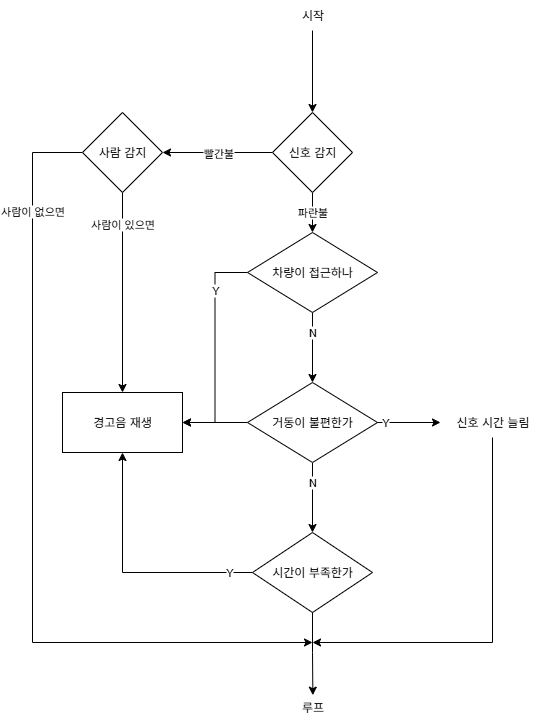
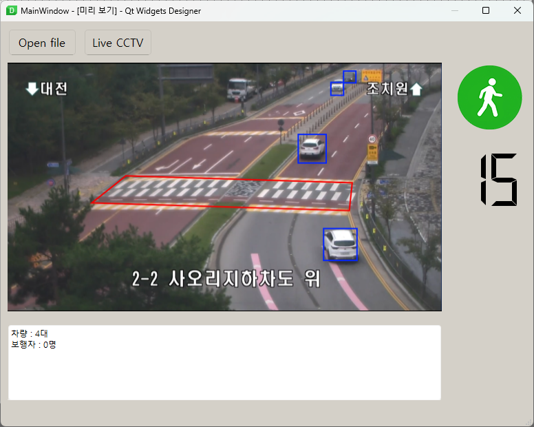
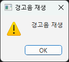

# 홍익대 OpenCV 실무 프로젝트 1조
## 문서
* 계획서 : [링크](https://docs.google.com/document/d/18R3eeF_AJIPWrHmkONuViD_FoFXy8LPV/edit)
* PPT : [링크](https://docs.google.com/presentation/d/1q-a8FOxoGX1aSD66FCKSfEmWfIR9d9YC-bG86JSy4Yk/edit?usp=sharing)
## 2025.09.18
* 주제 선정
* 역할 분담
* 프로젝트 계획서 작성
* 간략한 프로그램 구상
  

## 2025.09.19
* UI 설계 

* 신호등 & 횡단보도 탐지 설계
  - 영상 안에서 신호등의 신호를 탐지하는 코드 & 영상 안에서 횡단보도의 위치, 영역을 탐지하는 코드
* 보행자 & 차량 탐지 설계
  - 영상 안에서 횡단보도 영역 표시 & 차량 탐지 & 보행자 탐지하는 코드
* 휠체어 관련 데이터셋 입수 후 학습
* 차량, 보행자 초기 모델 구현

